# [📈 Live Status](https://monitor.designa.mx): <!--live status--> **🟩 All systems operational**

This repository contains the open-source uptime monitor and status page for [Upptime](https://upptime.js.org), powered by [Upptime](https://github.com/upptime/upptime).

With [Upptime](https://upptime.js.org), you can get your own unlimited and free uptime monitor and status page, powered entirely by a GitHub repository. We use [Issues](https://github.com/upptime/upptime/issues) as incident reports, [Actions](https://github.com/designa-team/designa-uptime/actions) as uptime monitors, and [Pages](https://monitor.designa.mx) for the status page.

<!--start: status pages-->
<!-- This summary is generated by Upptime (https://github.com/upptime/upptime) -->
<!-- Do not edit this manually, your changes will be overwritten -->
<!-- prettier-ignore -->
| URL | Status | History | Response Time | Uptime |
| --- | ------ | ------- | ------------- | ------ |
|  [MASTERMANUAL](https://mastermanual.mx/) | 🟩 Up | [mastermanual.yml](https://github.com/designa-team/designa-uptime/commits/HEAD/history/mastermanual.yml) | 

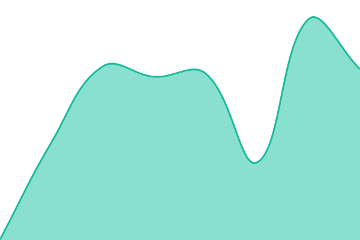 289ms
     
 | 

<a href="https://designa-team.github.io/designa-uptime/history/mastermanual">100.00%</a>
    

|  [UPA](https://upa.edu.mx) | 🟩 Up | [upa.yml](https://github.com/designa-team/designa-uptime/commits/HEAD/history/upa.yml) | 

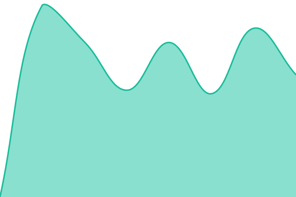 972ms
     
 | 

<a href="https://designa-team.github.io/designa-uptime/history/upa">100.00%</a>
    

|  [UPA REVISTA](https://revistapolitecnicaags.upa.edu.mx/) | 🟩 Up | [upa-revista.yml](https://github.com/designa-team/designa-uptime/commits/HEAD/history/upa-revista.yml) | 

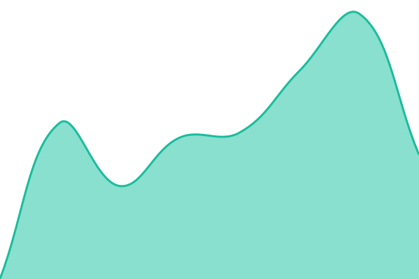 453ms
     
 | 

<a href="https://designa-team.github.io/designa-uptime/history/upa-revista">100.00%</a>
    

|  [UPA MOODLE](https://moodle.upa.edu.mx/) | 🟩 Up | [upa-moodle.yml](https://github.com/designa-team/designa-uptime/commits/HEAD/history/upa-moodle.yml) | 

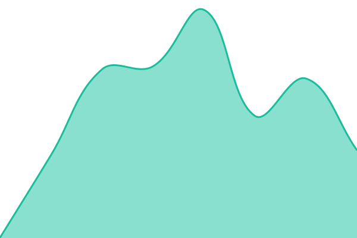 527ms
     
 | 

<a href="https://designa-team.github.io/designa-uptime/history/upa-moodle">100.00%</a>
    

|  [UPA TITULACIÓN](https://titulacion.upa.edu.mx/) | 🟩 Up | [upa-titulacion.yml](https://github.com/designa-team/designa-uptime/commits/HEAD/history/upa-titulacion.yml) | 

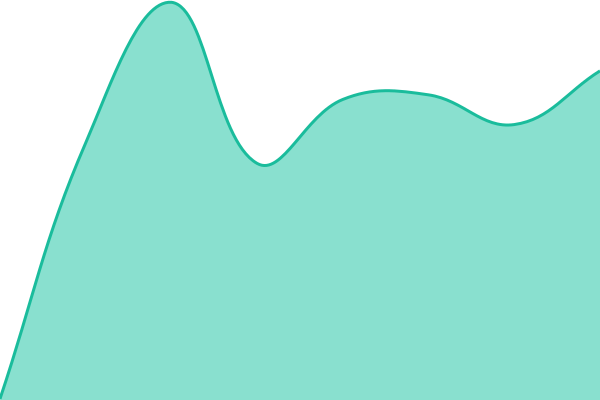 300ms
     
 | 

<a href="https://designa-team.github.io/designa-uptime/history/upa-titulacion">100.00%</a>
    

|  [UPA CAJAS](https://cajas.upa.edu.mx/) | 🟩 Up | [upa-cajas.yml](https://github.com/designa-team/designa-uptime/commits/HEAD/history/upa-cajas.yml) | 

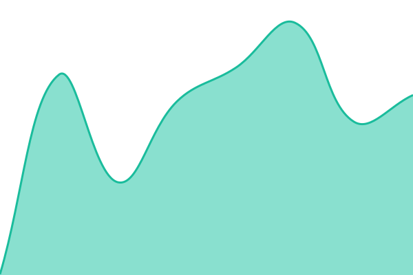 277ms
     
 | 

<a href="https://designa-team.github.io/designa-uptime/history/upa-cajas">100.00%</a>
    

|  [IEEC](https://ieec.mx/) | 🟩 Up | [ieec.yml](https://github.com/designa-team/designa-uptime/commits/HEAD/history/ieec.yml) | 

 270ms
     
 | 

<a href="https://designa-team.github.io/designa-uptime/history/ieec">100.00%</a>
    

|  [MEGAWATT](https://megawatt.com.mx/) | 🟩 Up | [megawatt.yml](https://github.com/designa-team/designa-uptime/commits/HEAD/history/megawatt.yml) | 

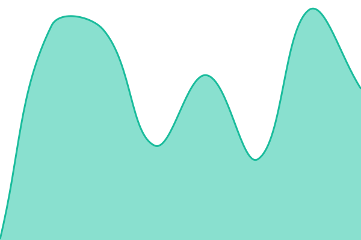 195ms
     
 | 

<a href="https://designa-team.github.io/designa-uptime/history/megawatt">100.00%</a>
    

|  [CN CENTER](https://causanaturacenter.org/) | 🟩 Up | [cn-center.yml](https://github.com/designa-team/designa-uptime/commits/HEAD/history/cn-center.yml) | 

 900ms
     
 | 

<a href="https://designa-team.github.io/designa-uptime/history/cn-center">100.00%</a>
    

|  [CN MEDIA](https://causanaturamedia.com/) | 🟩 Up | [cn-media.yml](https://github.com/designa-team/designa-uptime/commits/HEAD/history/cn-media.yml) | 

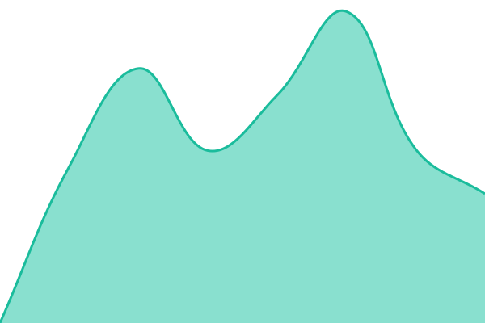 1671ms
     
 | 

<a href="https://designa-team.github.io/designa-uptime/history/cn-media">100.00%</a>
    

|  [CN DONACIONES](https://donaciones.causanatura.org/en) | 🟩 Up | [cn-donaciones.yml](https://github.com/designa-team/designa-uptime/commits/HEAD/history/cn-donaciones.yml) | 

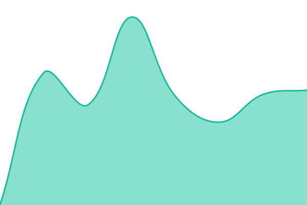 704ms
     
 | 

<a href="https://designa-team.github.io/designa-uptime/history/cn-donaciones">100.00%</a>
    

|  [Aprender Parejo](https://aprenderparejo.mx/) | 🟩 Up | [aprender-parejo.yml](https://github.com/designa-team/designa-uptime/commits/HEAD/history/aprender-parejo.yml) | 

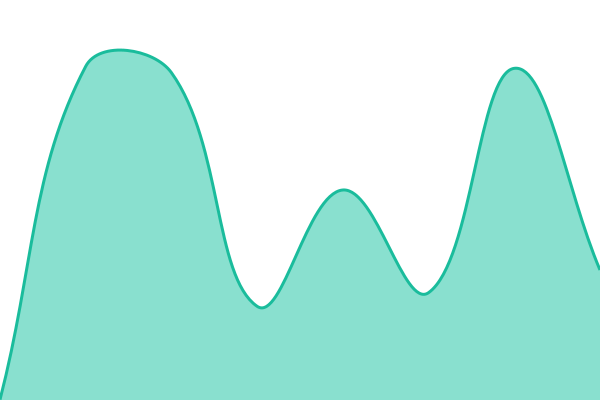 620ms
     
 | 

<a href="https://designa-team.github.io/designa-uptime/history/aprender-parejo">100.00%</a>
    

|  [Canvas ucags](https://canvas.ucags.edu.mx/login/canvas) | 🟩 Up | [canvas-ucags.yml](https://github.com/designa-team/designa-uptime/commits/HEAD/history/canvas-ucags.yml) | 

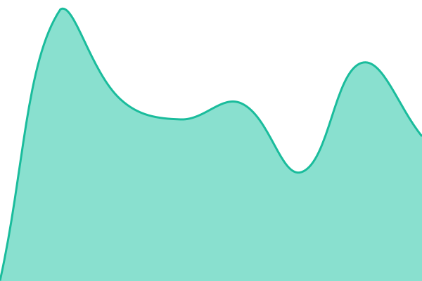 592ms
     
 | 

<a href="https://designa-team.github.io/designa-uptime/history/canvas-ucags">100.00%</a>
    

|  [Encuestaspec cuestionarios](https://encuestaspec.com/) | 🟩 Up | [encuestaspec-cuestionarios.yml](https://github.com/designa-team/designa-uptime/commits/HEAD/history/encuestaspec-cuestionarios.yml) | 

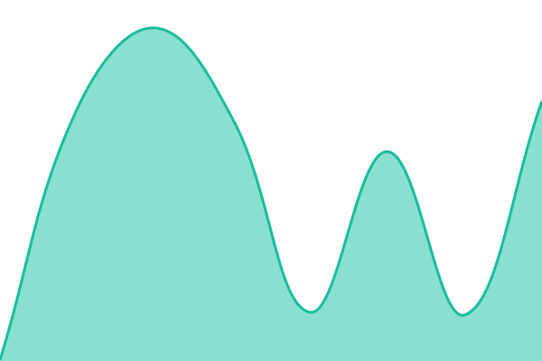 190ms
     
 | 

<a href="https://designa-team.github.io/designa-uptime/history/encuestaspec-cuestionarios">100.00%</a>
    

|  [Moodle Enrr](https://moodle.enrr.edu.mx/) | 🟩 Up | [moodle-enrr.yml](https://github.com/designa-team/designa-uptime/commits/HEAD/history/moodle-enrr.yml) | 

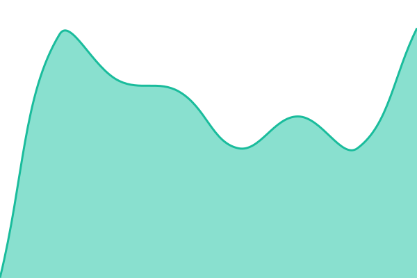 554ms
     
 | 

<a href="https://designa-team.github.io/designa-uptime/history/moodle-enrr">100.00%</a>
    

|  [Prosinergia Enrr](https://enrr.prosinergia.mx/auth/login) | 🟩 Up | [prosinergia-enrr.yml](https://github.com/designa-team/designa-uptime/commits/HEAD/history/prosinergia-enrr.yml) | 

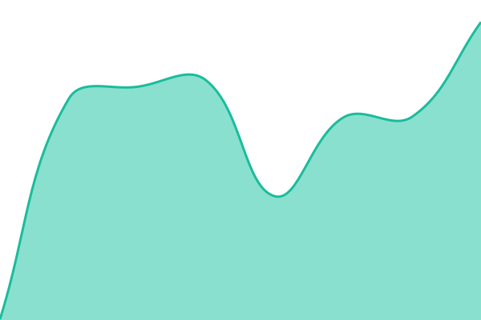 261ms
     
 | 

<a href="https://designa-team.github.io/designa-uptime/history/prosinergia-enrr">100.00%</a>
    

|  [Prosinergia Ucags](https://ucags.prosinergia.mx/auth/login) | 🟩 Up | [prosinergia-ucags.yml](https://github.com/designa-team/designa-uptime/commits/HEAD/history/prosinergia-ucags.yml) | 

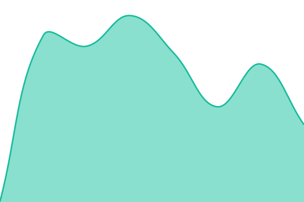 265ms
     
 | 

<a href="https://designa-team.github.io/designa-uptime/history/prosinergia-ucags">100.00%</a>
    

|  [Prosinergia Upa](https://upa.prosinergia.mx/auth/login) | 🟩 Up | [prosinergia-upa.yml](https://github.com/designa-team/designa-uptime/commits/HEAD/history/prosinergia-upa.yml) | 

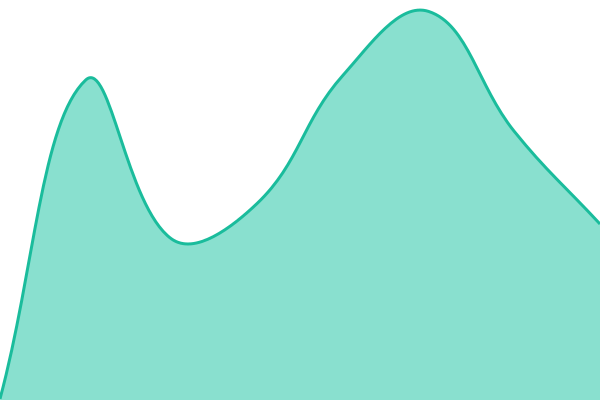 239ms
     
 | 

<a href="https://designa-team.github.io/designa-uptime/history/prosinergia-upa">100.00%</a>
    

|  [Rutas Qro](https://rutasqro.ieec.mx/) | 🟩 Up | [rutas-qro.yml](https://github.com/designa-team/designa-uptime/commits/HEAD/history/rutas-qro.yml) | 

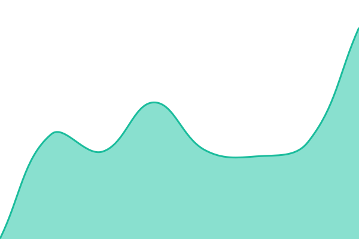 298ms
     
 | 

<a href="https://designa-team.github.io/designa-uptime/history/rutas-qro">100.00%</a>
    

|  [Sive Ram api](sive-ram-api.designa.mx/api/v1/health) | 🟩 Up | [sive-ram-api.yml](https://github.com/designa-team/designa-uptime/commits/HEAD/history/sive-ram-api.yml) | 

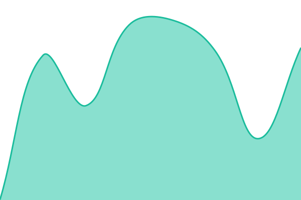 395ms
     
 | 

<a href="https://designa-team.github.io/designa-uptime/history/sive-ram-api">100.00%</a>
    

|  [Sonar Qube](https://sonar.designa.mx/sessions/new?return_to=%2F) | 🟩 Up | [sonar-qube.yml](https://github.com/designa-team/designa-uptime/commits/HEAD/history/sonar-qube.yml) | 

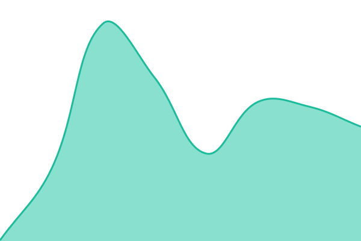 236ms
     
 | 

<a href="https://designa-team.github.io/designa-uptime/history/sonar-qube">100.00%</a>
    

|  [Informe Unete](https://informe-unete.designa.mx/) | 🟩 Up | [informe-unete.yml](https://github.com/designa-team/designa-uptime/commits/HEAD/history/informe-unete.yml) | 

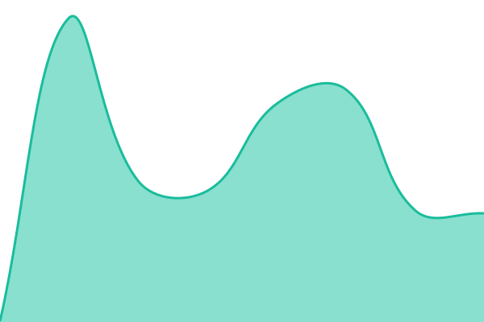 242ms
     
 | 

<a href="https://designa-team.github.io/designa-uptime/history/informe-unete">100.00%</a>
    

|  [Prosistemas](https://prosistemas.mx/) | 🟩 Up | [prosistemas.yml](https://github.com/designa-team/designa-uptime/commits/HEAD/history/prosistemas.yml) | 

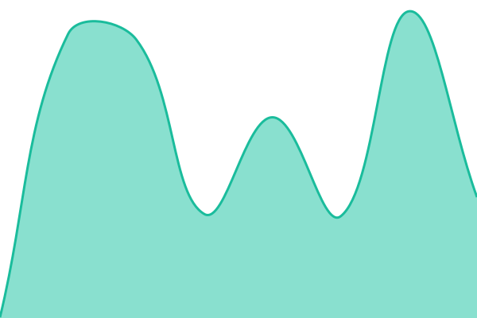 280ms
     
 | 

<a href="https://designa-team.github.io/designa-uptime/history/prosistemas">100.00%</a>
    

|  [Unete Prod Web](terminos.designa.mx) | 🟩 Up | [unete-prod-web.yml](https://github.com/designa-team/designa-uptime/commits/HEAD/history/unete-prod-web.yml) | 

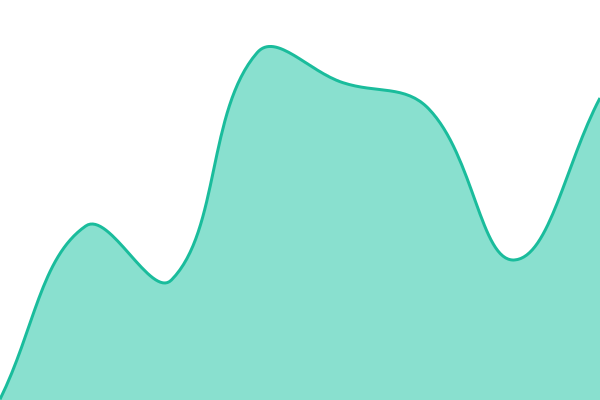 333ms
     
 | 

<a href="https://designa-team.github.io/designa-uptime/history/unete-prod-web">100.00%</a>
    

|  [Campus Virtual](https://virtual.ucags.edu.mx/) | 🟩 Up | [campus-virtual.yml](https://github.com/designa-team/designa-uptime/commits/HEAD/history/campus-virtual.yml) | 

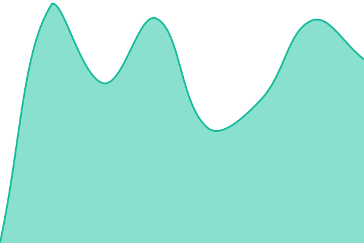 508ms
     
 | 

<a href="https://designa-team.github.io/designa-uptime/history/campus-virtual">100.00%</a>
    

|  [Aprender Parejo Queretaro](https://queretaro.aprenderparejo.mx/) | 🟩 Up | [aprender-parejo-queretaro.yml](https://github.com/designa-team/designa-uptime/commits/HEAD/history/aprender-parejo-queretaro.yml) | 

 686ms
     
 | 

<a href="https://designa-team.github.io/designa-uptime/history/aprender-parejo-queretaro">100.00%</a>
    

|  [Upa campus digital santander](https://campusdigital.upa.edu.mx/status) | 🟩 Up | [upa-campus-digital-santander.yml](https://github.com/designa-team/designa-uptime/commits/HEAD/history/upa-campus-digital-santander.yml) | 

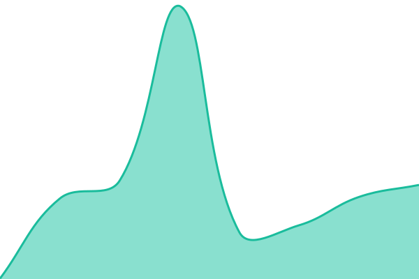 268ms
     
 | 

<a href="https://designa-team.github.io/designa-uptime/history/upa-campus-digital-santander">100.00%</a>
    

|  [Apt ieec](https://apt.ieec.mx/) | 🟩 Up | [apt-ieec.yml](https://github.com/designa-team/designa-uptime/commits/HEAD/history/apt-ieec.yml) | 

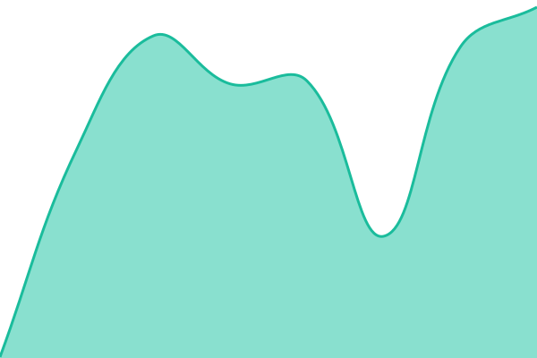 237ms
     
 | 

<a href="https://designa-team.github.io/designa-uptime/history/apt-ieec">100.00%</a>
    

|  [Apt web ingress](https://aprendizajes-para-todos.ieec.mx/) | 🟩 Up | [apt-web-ingress.yml](https://github.com/designa-team/designa-uptime/commits/HEAD/history/apt-web-ingress.yml) | 

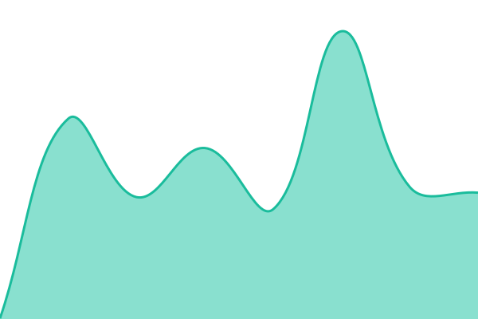 297ms
     
 | 

<a href="https://designa-team.github.io/designa-uptime/history/apt-web-ingress">100.00%</a>
    

|  [Servicios escolares upa](https://alumnos.upa.edu.mx/) | 🟩 Up | [servicios-escolares-upa.yml](https://github.com/designa-team/designa-uptime/commits/HEAD/history/servicios-escolares-upa.yml) | 

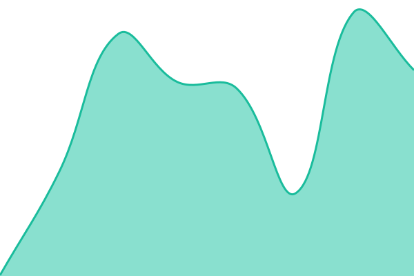 211ms
     
 | 

<a href="https://designa-team.github.io/designa-uptime/history/servicios-escolares-upa">100.00%</a>
    

|  [Covid ieec](https://covid.ieec.mx/) | 🟩 Up | [covid-ieec.yml](https://github.com/designa-team/designa-uptime/commits/HEAD/history/covid-ieec.yml) | 

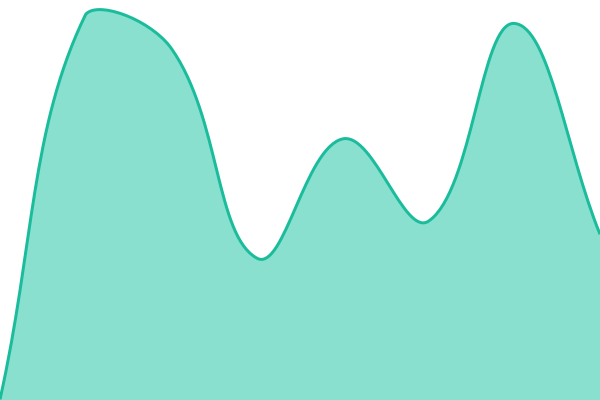 447ms
     
 | 

<a href="https://designa-team.github.io/designa-uptime/history/covid-ieec">100.00%</a>
    

|  [Grafana Designa](https://grafana.designa.mx/login) | 🟩 Up | [grafana-designa.yml](https://github.com/designa-team/designa-uptime/commits/HEAD/history/grafana-designa.yml) | 

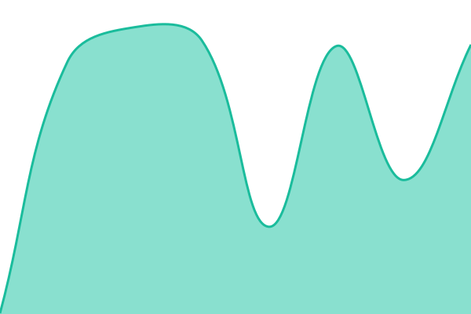 246ms
     
 | 

<a href="https://designa-team.github.io/designa-uptime/history/grafana-designa">100.00%</a>
    

|  [Diagnostico apt ieec](https://diagnostico.ieec.mx/) | 🟩 Up | [diagnostico-apt-ieec.yml](https://github.com/designa-team/designa-uptime/commits/HEAD/history/diagnostico-apt-ieec.yml) | 

 226ms
     
 | 

<a href="https://designa-team.github.io/designa-uptime/history/diagnostico-apt-ieec">100.00%</a>
    

|  [Finanzas Causa Natura](https://causanatura.designa.mx/) | 🟩 Up | [finanzas-causa-natura.yml](https://github.com/designa-team/designa-uptime/commits/HEAD/history/finanzas-causa-natura.yml) | 

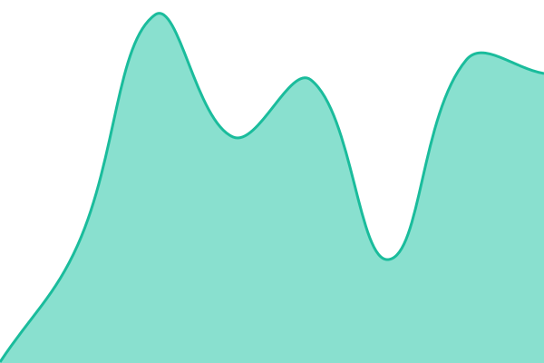 207ms
     
 | 

<a href="https://designa-team.github.io/designa-uptime/history/finanzas-causa-natura">100.00%</a>
    

|  [Landing designa](https://designa.mx/) | 🟩 Up | [landing-designa.yml](https://github.com/designa-team/designa-uptime/commits/HEAD/history/landing-designa.yml) | 

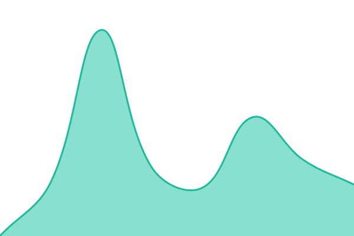 757ms
     
 | 

<a href="https://designa-team.github.io/designa-uptime/history/landing-designa">100.00%</a>
    

|  [Nl Aprende ieec](https://nlaprende.ieec.mx/) | 🟩 Up | [nl-aprende-ieec.yml](https://github.com/designa-team/designa-uptime/commits/HEAD/history/nl-aprende-ieec.yml) | 

 253ms
     
 | 

<a href="https://designa-team.github.io/designa-uptime/history/nl-aprende-ieec">100.00%</a>
    

|  [Oaxaca ieec](https://oaxaca.ieec.mx/) | 🟩 Up | [oaxaca-ieec.yml](https://github.com/designa-team/designa-uptime/commits/HEAD/history/oaxaca-ieec.yml) | 

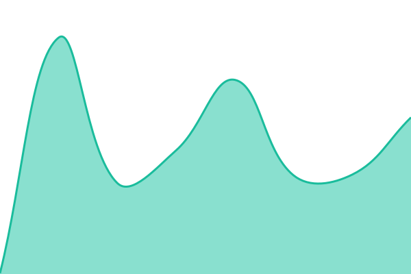 251ms
     
 | 

<a href="https://designa-team.github.io/designa-uptime/history/oaxaca-ieec">100.00%</a>
    

|  [Unete ieec](https://unete.designa.mx/) | 🟩 Up | [unete-ieec.yml](https://github.com/designa-team/designa-uptime/commits/HEAD/history/unete-ieec.yml) | 

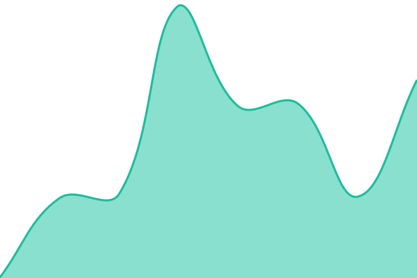 220ms
     
 | 

<a href="https://designa-team.github.io/designa-uptime/history/unete-ieec">100.00%</a>
    

|  [Unetec ieec](https://unetec.designa.mx/) | 🟩 Up | [unetec-ieec.yml](https://github.com/designa-team/designa-uptime/commits/HEAD/history/unetec-ieec.yml) | 

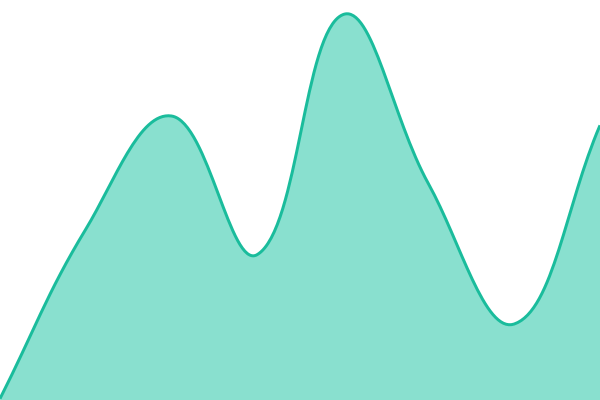 193ms
     
 | 

<a href="https://designa-team.github.io/designa-uptime/history/unetec-ieec">100.00%</a>
    

|  [Prosinergia mx](https://prosinergia.mx/) | 🟩 Up | [prosinergia-mx.yml](https://github.com/designa-team/designa-uptime/commits/HEAD/history/prosinergia-mx.yml) | 

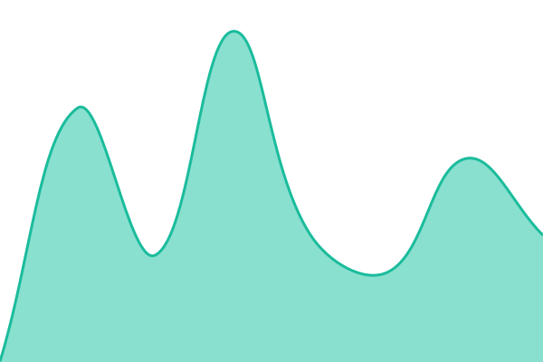 356ms
     
 | 

<a href="https://designa-team.github.io/designa-uptime/history/prosinergia-mx">100.00%</a>
    

|  [Wordpress enrr](https://enrr.edu.mx/) | 🟩 Up | [wordpress-enrr.yml](https://github.com/designa-team/designa-uptime/commits/HEAD/history/wordpress-enrr.yml) | 

 391ms
     
 | 

<a href="https://designa-team.github.io/designa-uptime/history/wordpress-enrr">100.00%</a>
    

|  [Intranet upa](https://intranet.upa.edu.mx/) | 🟩 Up | [intranet-upa.yml](https://github.com/designa-team/designa-uptime/commits/HEAD/history/intranet-upa.yml) | 

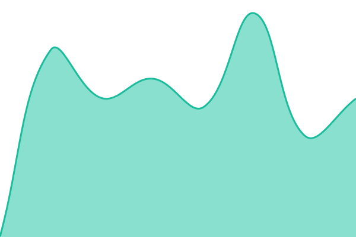 356ms
     
 | 

<a href="https://designa-team.github.io/designa-uptime/history/intranet-upa">100.00%</a>
    

|  [Acuerdo 286](https://plataforma286.ortegaygasset.mx/) | 🟩 Up | [acuerdo-286.yml](https://github.com/designa-team/designa-uptime/commits/HEAD/history/acuerdo-286.yml) | 

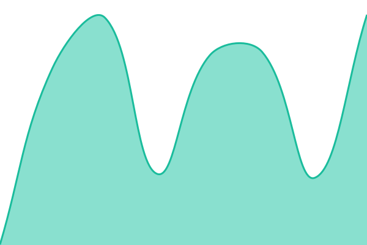 481ms
     
 | 

<a href="https://designa-team.github.io/designa-uptime/history/acuerdo-286">100.00%</a>
    

|  [V2 Ieec](https://v2.ieec.mx/) | 🟩 Up | [v2-ieec.yml](https://github.com/designa-team/designa-uptime/commits/HEAD/history/v2-ieec.yml) | 

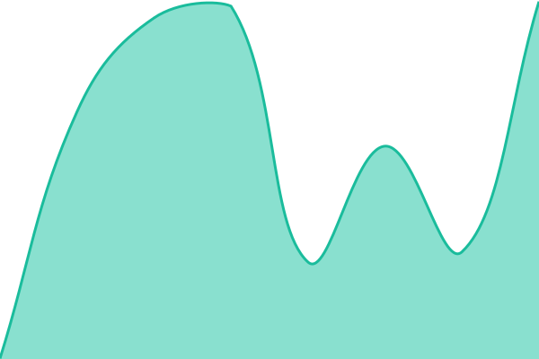 394ms
     
 | 

<a href="https://designa-team.github.io/designa-uptime/history/v2-ieec">100.00%</a>
    

|  [Sii upa](https://sii.upa.edu.mx/) | 🟩 Up | [sii-upa.yml](https://github.com/designa-team/designa-uptime/commits/HEAD/history/sii-upa.yml) | 

 346ms
     
 | 

<a href="https://designa-team.github.io/designa-uptime/history/sii-upa">100.00%</a>
    

|  [Canvas ieec](https://canvas.ieec.mx/login/canvas) | 🟩 Up | [canvas-ieec.yml](https://github.com/designa-team/designa-uptime/commits/HEAD/history/canvas-ieec.yml) | 

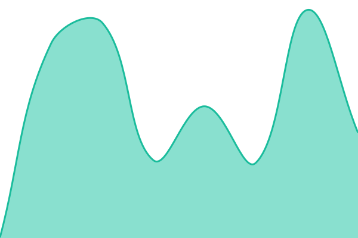 1487ms
     
 | 

<a href="https://designa-team.github.io/designa-uptime/history/canvas-ieec">100.00%</a>
    

|  [Acuerdo286 demo](https://stage-acuerdo286.designa.mx/) | 🟩 Up | [acuerdo286-demo.yml](https://github.com/designa-team/designa-uptime/commits/HEAD/history/acuerdo286-demo.yml) | 

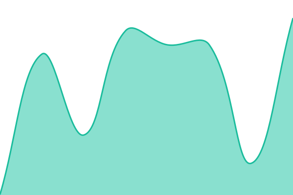 192ms
     
 | 

<a href="https://designa-team.github.io/designa-uptime/history/acuerdo286-demo">100.00%</a>
    

|  [Rimaems pwa](https://rimaems-pwa.ieec.mx/) | 🟩 Up | [rimaems-pwa.yml](https://github.com/designa-team/designa-uptime/commits/HEAD/history/rimaems-pwa.yml) | 

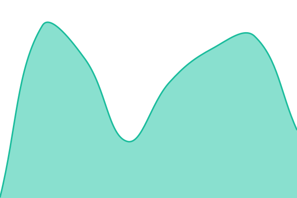 193ms
     
 | 

<a href="https://designa-team.github.io/designa-uptime/history/rimaems-pwa">100.00%</a>
    

|  [Cms ieec](https://cms.ieec.mx/admin/auth/login) | 🟩 Up | [cms-ieec.yml](https://github.com/designa-team/designa-uptime/commits/HEAD/history/cms-ieec.yml) | 

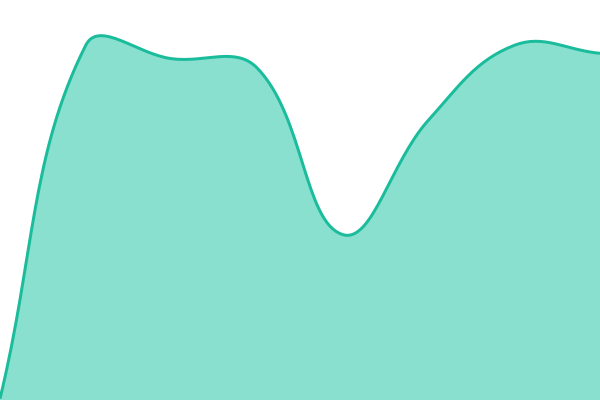 202ms
     
 | 

<a href="https://designa-team.github.io/designa-uptime/history/cms-ieec">100.00%</a>
    

|  [Encuestas CN](https://encuestas.causanatura.org/auth) | 🟩 Up | [encuestas-cn.yml](https://github.com/designa-team/designa-uptime/commits/HEAD/history/encuestas-cn.yml) | 

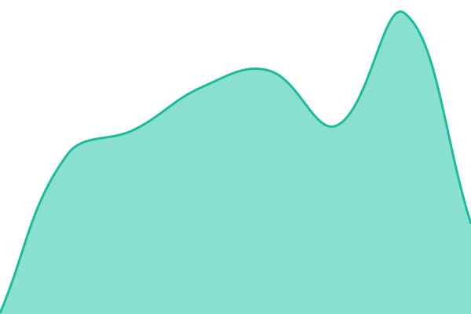 225ms
     
 | 

<a href="https://designa-team.github.io/designa-uptime/history/encuestas-cn">100.00%</a>
    

<!--end: status pages-->

[**Visit our status website →**](https://monitor.designa.mx)

## 📄 License

- Powered by: [Upptime](https://github.com/upptime/upptime)
- Code: [MIT](./LICENSE) © [Upptime](https://upptime.js.org)
- Data in the `./history` directory: [Open Database License](https://opendatacommons.org/licenses/odbl/1-0/)
